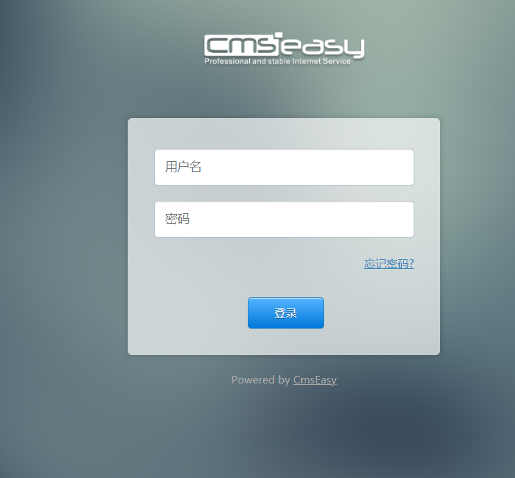
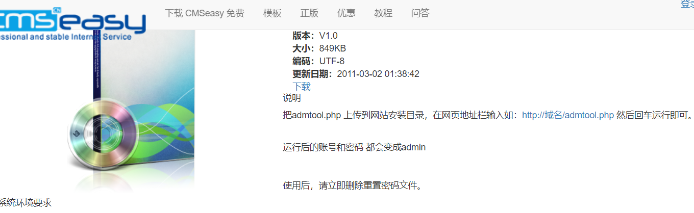
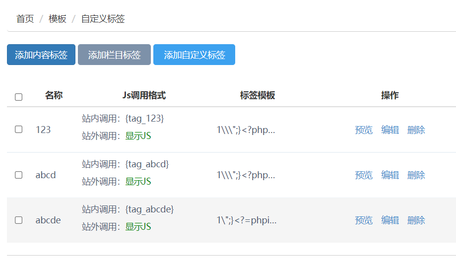
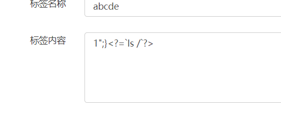
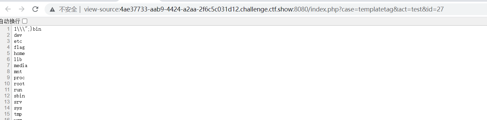

# web477
## 网站后台
网站默认后台为`index.php?case=admin&act=login&admin_dir=admin&site=default`

点击忘记密码，

密码重置后初始化为admin/admin(本题中不需要重置)
输入之后登录
## 寻找漏洞
本题中的漏洞出现在**模板-自定义标签**中，点击添加自定义标签，名称随意，内容作为payload，如下
`payload 1";}<?=phpinfo()?>`

点击预览，可以看到，php成功执行，使用"\`"执行命令

读了根目录下的flag发现是个假的，最后找到flag在phpinfo里。